# Sky Rune

## IMPORTANT
With the intention of reducing the weight of the project and being able to upload it to Github:
- Folders that are not necessary have been removed, so it is necessary to connect to the internet to open it correctly in Unity.
- The folder Game Assets have been put in a zip so, for the project to work correctly in Unity, it is necessary to download to the following link to Drive [Game Assets](https://drive.google.com/file/d/1Z0YxQ3irFpu_p41AQCzgtEy2aC4lYde2/view?usp=sharing) and unpack the contents of the zip in the FinalProject/Assets/ path once the project is in local.

## Game

Sky Rune is a 3D platformer game made in Unity 2023.2.0b17 (necessary due to the import of some assets from Unity Assets Store). In this game, the player will be able to control a character (Ellen) who must be guided through a world made up of platforms (some of them are moving platforms) until she collects special gems that activate the portal (victory condition) or until she falls from the platforms and loses the level.

## Screen flow
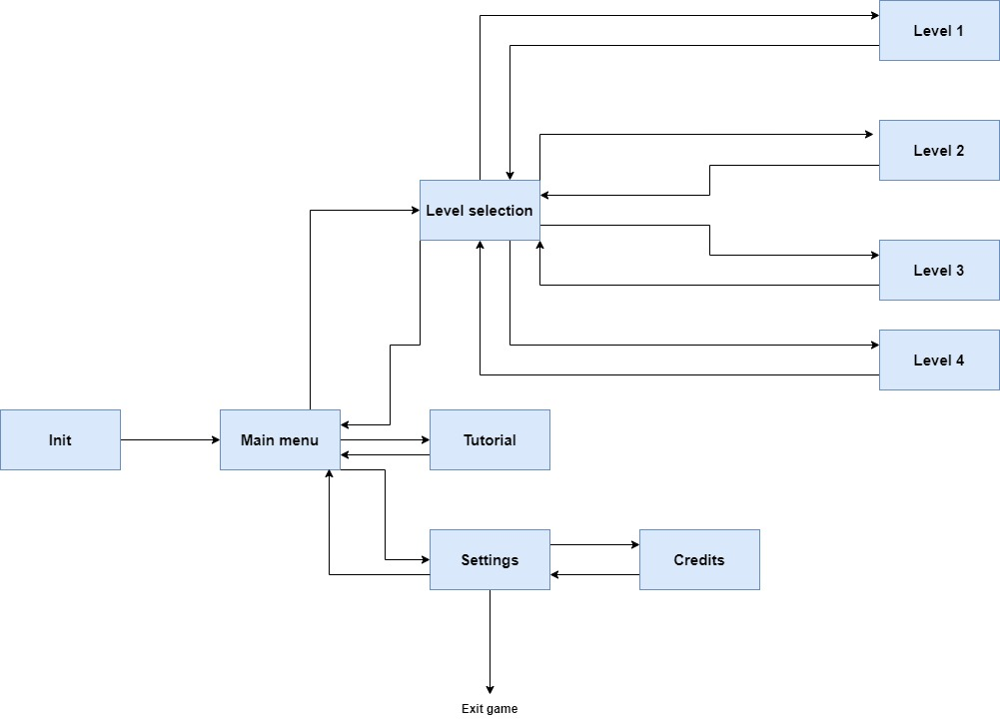

In the game, there are 10 different scenes:

- **Init**: the first scene that is shown to the player. It contains a start button that makes appears the main menu.
- **Main menu**: from this scene, the player can access the level selection screen, the game tutorial, the settings, or can exit the game.
- **Level Selection**: in this scene, the player can choose the level that want to play.
- **Level 1**: scene for the first level.
- **Level 2**: scene for the second level.
- **Level 3**: scene for the third level.
- **Level 4**: scene for the last level of the game.
- **Tutorial**: scene in which appears a tutorial that explains the mechanics of the game, the game over condition and the victory one.
- **Settings**: in this scene, the player can delete the current progress (delete the persistent score to start from the beginning) and access to the credits screen.
- **Credits**: from this scene, the player can access to all the resources (assets and music) that are used in the game.

## Specifications

The game contains the following specifications and funcionalities:

### Delivery requirements (specifications)

- **1.** The game is made with Unity 2023.2.0b17.
- **2.** The game starts in the init screen, has an exit game button and its objective (for the player) is to complete 4 different levels, getting the highest score possible.
- **3.** The game has 4 GameState in level scenes:
  - **Mission state**: in this state, the time of the game is paused and the player can only read the mission text in which its specifies the goal of the level and that shows some tips.
  - **Game state**: in this state, the time of the game is reactivated and the player can control the character.
  - **Game Over state**: this state is activated when the character falls form the platform or loses all her health, showing a game over panel to the player and stoping the game time.
  - **Victory state**: this state is activated when the player gets all the special gems of the level (that activate the portal) and collides with the portal, stoping the game time and showing the score obtained.
- **4.** The game has a victory condition (obtain all the special gems in each level and collide with the portal) and a game over condition (fall from platform or lose all the health).
- **5.** Most of the assets are from Unity Asset Store or other pages of resources but the game has an own and handwritten code.
- **6.** The game implement some aspects from the course such as the use of collisions to get gems (score) and activate other gems, a score increase..., and other different ones like the use of playerPrefs for persistent data saving, the use of links in the game (credits), the use of coroutines to have more control of damage and the use of events for communication between the game and the UI.

### Others funcionalities

- **1.** It has been implemented an Input Handler and the possibility that the character can carry small boxes. In addition, a third-person camera has been developed that allows the player to see what is around the character, and zoom in and zoom out.
- **2.** Unity playerPrefs have been used to save persistent score and to allows the player delete it and start the game from the beginning.
- **3.** A code has been implemented to control the level selection interface, causing it to update automatically according to the maximum score that the player has obtained in each level, showing both the score and the stars obtained based on it and locked the levels 
when the player has not passed the previous level.
- **4.** It has been created a code that allows music to continue between scenes in the menu. This has been implemented with the intention of preventing the menu music from restarting every time the scene is changed.
- **5.** A code has been implemented to allows the player push big boxes to avoid the damage of spikes in some zones of the levels.
- **6.** Coroutines have been used to have better control of the damage caused by the spikes, giving the player a time in which the character can't be affected by them if the damage has already occurred.
- **7.** It has been implemented a code to communicate the score and special gems obtained in the level between the game and the interface through events.
- **8.** It have been created moving platforms that follow a specific route, allowing the player to move from one area of ​​the level to another.
- **9.** It have been created slopes in the levels and, through code, the physics necessary for the player to fall down from them.

## Game mechanics

### Player movement 

To move the character, the player must press the arrows keys or the W, A ,S, D keys.

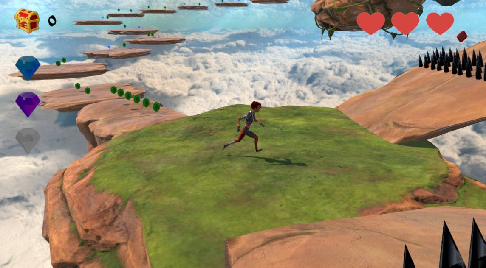

### Third person camera

The game includes a third person camera that allows the player see around the character, zoom in and zoom out.

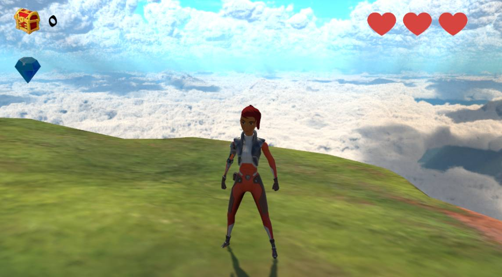

### Other actions

The character will jump if the player presses the Space Bar. Additionally, she can carry and drop small boxes if the player presses the P key.

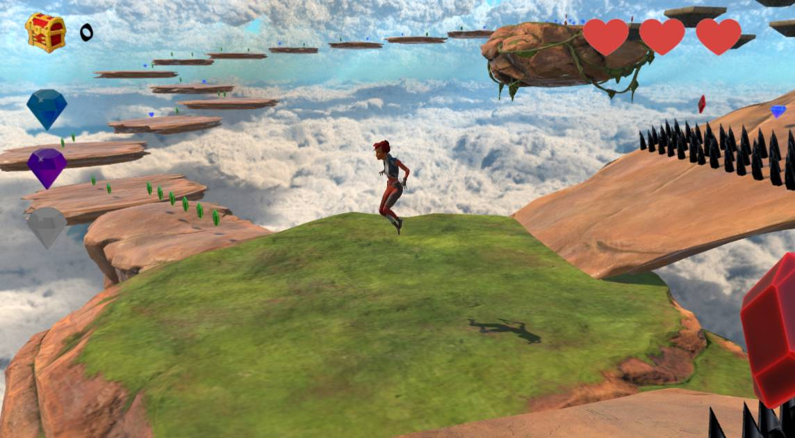
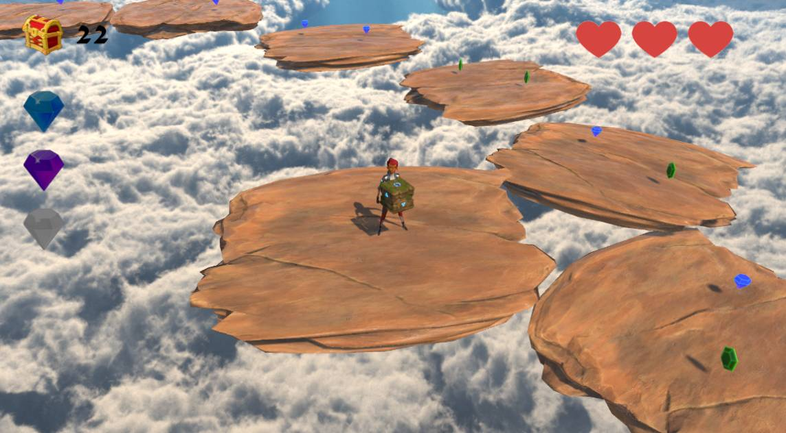

### Victory condition

To win the level, the player must get the special gems that are specified in the mission text to activate the portal and collides with it.

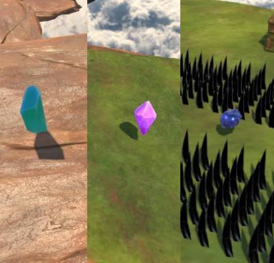
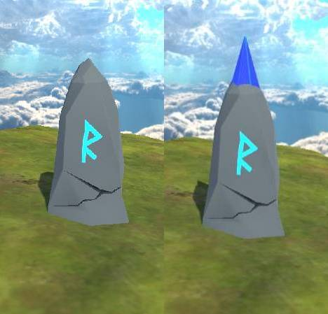

### Game Over condition

If the player falls down from the platform or loses all his health, the level will end and he has to start from the beggining of it.

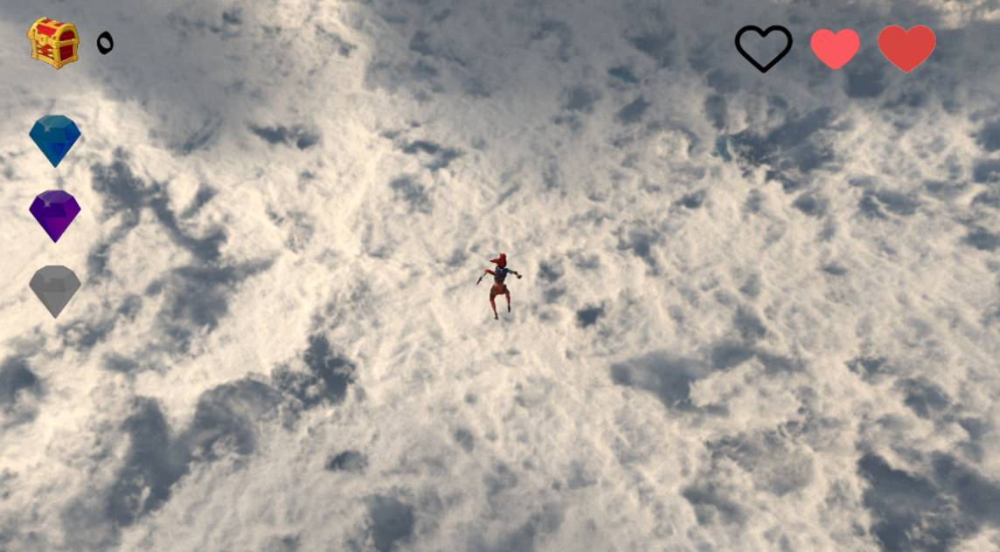

### Health and damage

The character has 3 hearts that will be increase or decrease depending on the damage received.

- **Health**: there are some special red gems that increase half heart the health of the character.
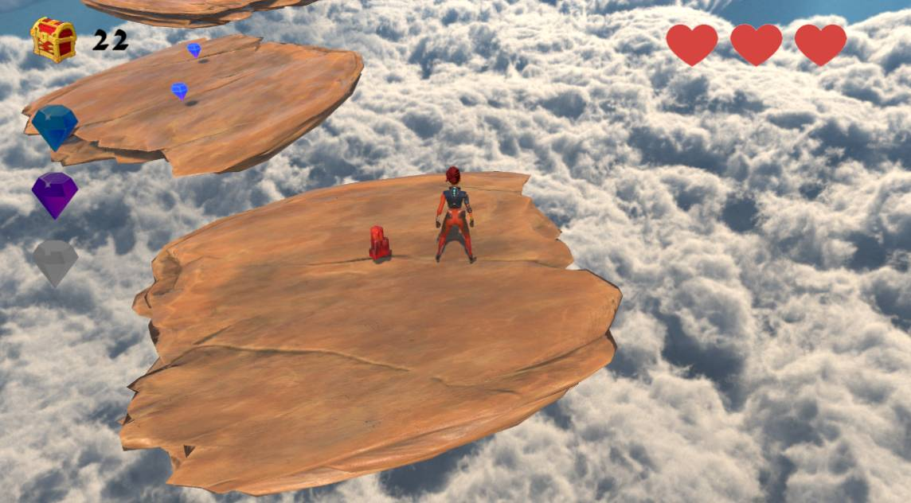
  
- **Damage**: in some zones there are spikes. That object decrese a half heart on each collision with the character.
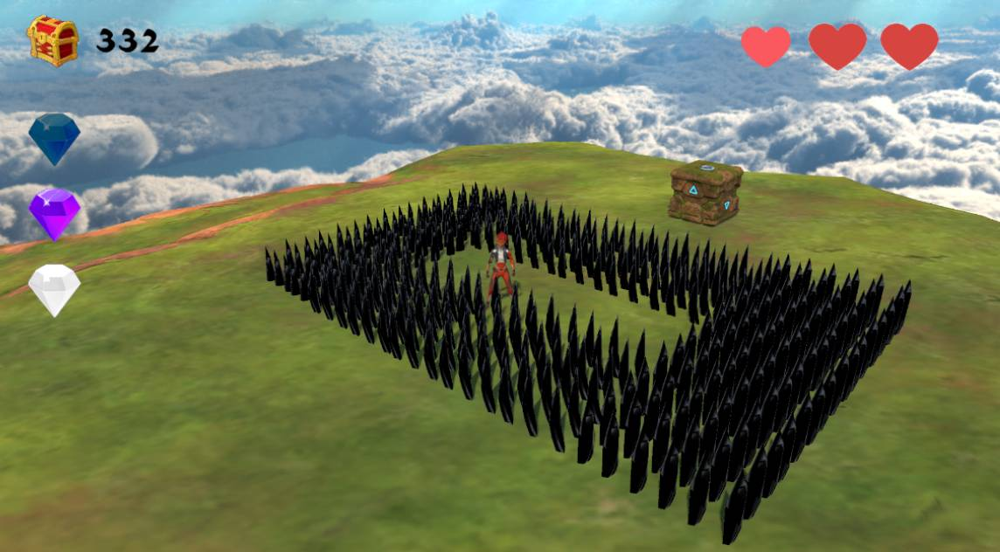

### Get points

During the levels, the player can find different types of gems. If him made the character collides with them, the score will increase. Depending on the type of gem that the player get, the score will be increse more or less points:
- **Green gems**: this gem worth 1 point.
- **Blue gems**: this gem worth 5 points.
- **Red gems**: this gem worth 20 points.

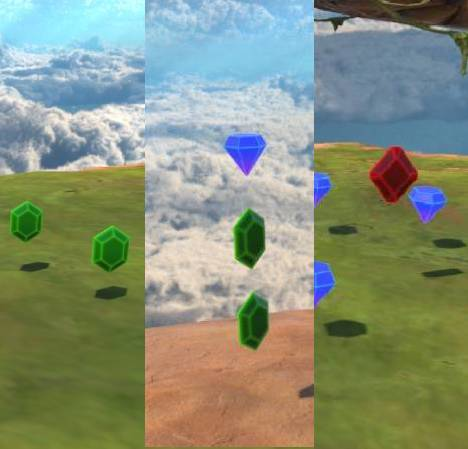

### Pressed pads

In some zones of the levels, there are pressed pads. These objects can only be activated if the player put over them a small box.

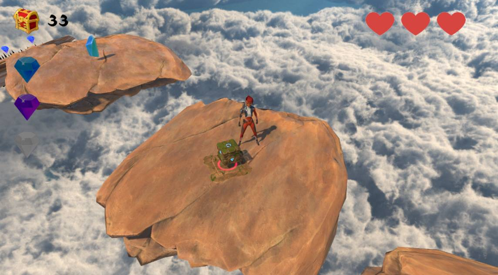

### Slopes

In some levels, there are slopes with different inclinations. If the inclination is big, the character is going to fall down faster, being more difficult to avoid the spikes.

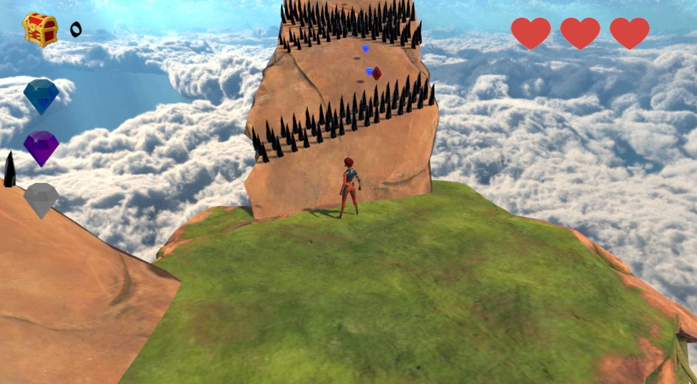

### Big boxes

In the levels, the player can find big boxes that can push and move and which can be used to avoid damage from spikes.

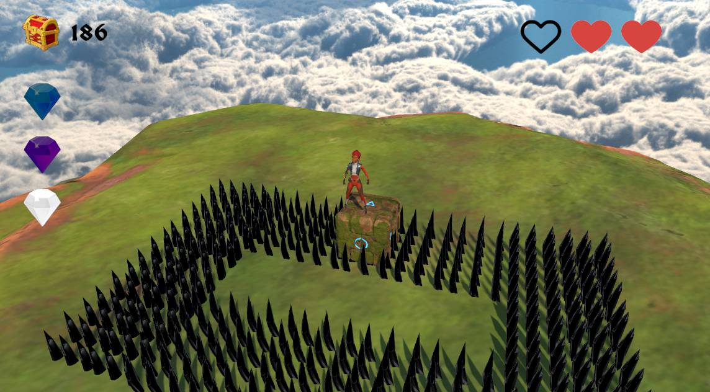

# Assets and music

This section shows the resources used to create the game.

## Assets

### UI Assets

- **Panels**: created by Black Hammer, [Unity Assets Store](https://assetstore.unity.com/packages/2d/gui/fantasy-wooden-gui-free-103811)
- **Stars**: created by Chocoball, [Unity Assets Store](https://assetstore.unity.com/packages/2d/gui/puzzle-stage-settings-gui-pack-147389)
- **Score and gems**: created by ArtZombie, [Unity Assets Store](https://assetstore.unity.com/packages/2d/gui/icons/storeiconui-124152)
- **Rest of the UI**: created by Kiranshastry, Vlad Szirka and Chanut, [Flaticon](https://www.flaticon.com/)

### 3D Assets

- **Character**: created by Unity Technologies, [Unity Assets Store](https://assetstore.unity.com/packages/3d/3d-game-kit-character-pack-135217)
- **Boxes**: created by Unity Technologies, [Unity Assets Store](https://assetstore.unity.com/packages/3d/3d-game-kit-props-pack-135218)
- **Environment**: created by Unity Technologies, [Unity Assets Store](https://assetstore.unity.com/packages/3d/3d-game-kit-environment-pack-135167)
- **Moving platforms**: created by @PaulosCreations, [Unity Assets Store](https://assetstore.unity.com/packages/3d/props/floatingplantpots-141013)
- **Gems**: created by TridentCorp, [Unity Assets Store](https://assetstore.unity.com/packages/3d/props/low-poly-gems-245515)
- **Portal**: created by Polytope Studio, [Unity Assets Store](https://assetstore.unity.com/packages/3d/environments/lowpoly-environment-nature-free-medieval-fantasy-series-187052)
- **Skybox**: created by Avionx, [Unity Assets Store](https://assetstore.unity.com/packages/2d/textures-materials/sky/skybox-series-free-103633)
- **Special gems**: created by ClayManStudio, [Unity Assets Store](https://assetstore.unity.com/packages/3d/props/toon-crystals-pack-66182)
  
## Music and Sound Effects

### Music

- **Menu Music**: created by Zapsplat, [Zapsplat](https://www.zapsplat.com/)
- **Level Music**: created by u_c527aedza4, [Pixabay](https://pixabay.com/es/music/optimista-nicholas-on-fire-174033/)

### Sound Effects

- **Get object**: created by Pixabay, [Pixabay](https://pixabay.com/sound-effects/decidemp3-14575/)
- **Damage**: created by Pixabay, [Pixabay](https://pixabay.com/es/sound-effects/hurt-c-08-102842/)
- **Victory effect**: created by Pixabay, [Pixabay](https://pixabay.com/es/sound-effects/winfantasia-6912/)
- **Game Over effect**: created by Pixabay, [Pixabay](https://pixabay.com/es/sound-effects/verloren-89595/)
- **Button sound**: created by UNIVERSFIELD, [Pixabay](https://pixabay.com/es/sound-effects/interface-124464/)
  

